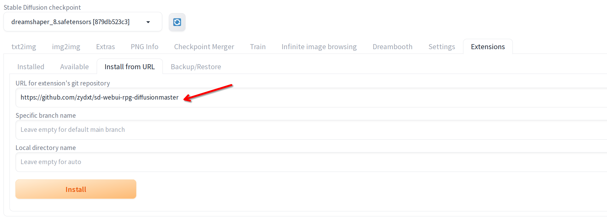
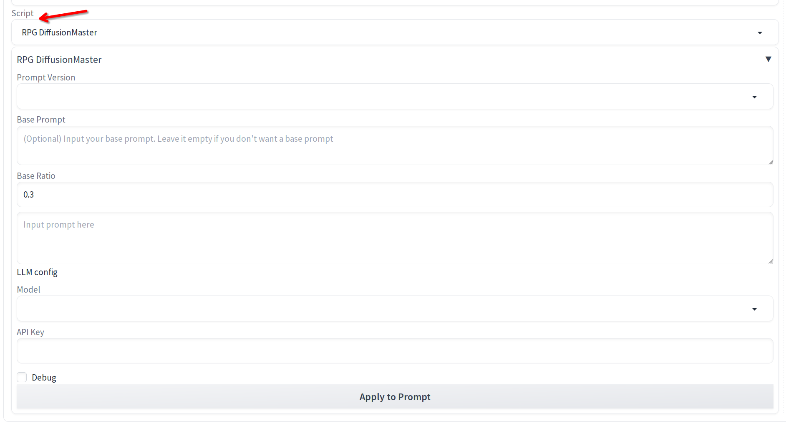
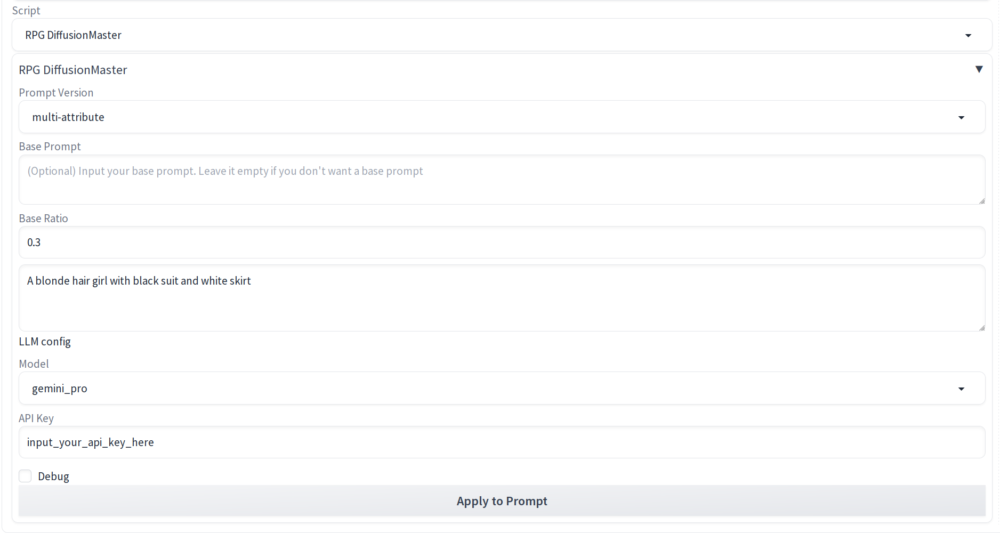

# RPG-DiffusionMaster Extension for Stable Diffusion WebUI  
  
This repository hosts an extension for [Stable Diffusion WebUI](https://github.com/AUTOMATIC1111/stable-diffusion-webui) that integrates the functionalities of [RPG-DiffusionMaster](https://github.com/YangLing0818/RPG-DiffusionMaster). It brings additional changes and enhancements, enabling users of WebUI to interact with RPG-DiffusionMaster more seamlessly.
  
For more information, check the official repo or the following paper:  
> [**Mastering Text-to-Image Diffusion: Recaptioning, Planning, and Generating with Multimodal LLMs**](https://arxiv.org/abs/2401.11708)
> Authors: [Ling Yang](https://yangling0818.github.io/), [Zhaochen Yu](https://github.com/BitCodingWalkin), [Chenlin Meng](https://cs.stanford.edu/~chenlin/), [Minkai Xu](https://minkaixu.com/), [Stefano Ermon](https://cs.stanford.edu/~ermon/), [Bin Cui](https://cuibinpku.github.io/) 
> Affiliations: **Peking University, Stanford University, Pika Labs** 
  
## Introduction 
  
Currently in an early phase of development, this extension employs LLMs (such as GPT4, Gemini Pro) for regional planning. It communicates the split ratios and regional prompts generated from LLMs to [Regional Prompter](https://github.com/hako-mikan/sd-webui-regional-prompter) for image generation, similar to the official [repository](https://github.com/YangLing0818/RPG-DiffusionMaster). 
  
## Installation 
  
Prior to installing this extension, ensure that the [Regional Prompter](https://github.com/hako-mikan/sd-webui-regional-prompter) extension is already set up on your system. This extension has not yet been added to the WebUI extensions index, and hence must be installed manually using the URL on the WebUI extension tab. 

  
## Usage 
  
1. Navigate to the txt2img tab. 
2. Choose RPG DiffusionMaster from the Script dropdown menu. 
_
3. Select your desired LLM and configure the settings for RPG-DiffusionMaster. 
_
4. Press the "Apply to Prompt" button and wait briefly as the extension processes the prompt through the LLM and adjusts the Regional Prompter configurations accordingly. 
5. Review the adjusted settings and the final prompt in the Prompt textbox. You can then modify parameters like image size, CFG Scale, Steps, etc., before generating your images. 
  
## To-Do List 💪 
  
- [ ] Integrate local LLM support. 
  
## Differences from the Official Implementation 
  
- Adds support for the OpenAI Azure GPT4 Model and Gemini Pro. 
- Local LLM support is pending. 
- Alters the logic to enhance stability when extracting regional prompts. 
  
## Acknowledgements 
  
A huge thank you to [Ling Yang](https://github.com/YangLing0818/RPG-DiffusionMaster) for the foundational RPG-DiffusionMaster implementation, [AUTOMATIC1111](https://github.com/AUTOMATIC1111/stable-diffusion-webui), and [regional-prompter](https://github.com/hako-mikan/sd-webui-regional-prompter) for their exceptional contributions and codebases. 
